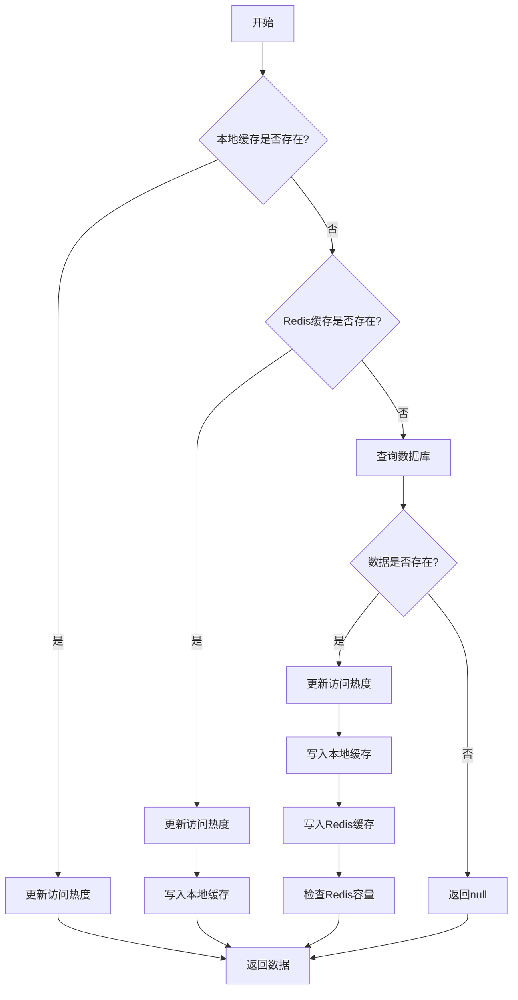
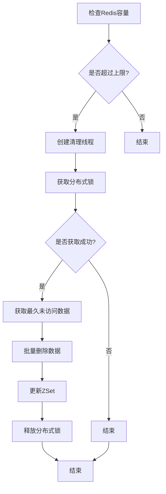

# 多级缓存演示项目

## 项目简介

这是一个基于 Spring Boot 的多级缓存演示项目，实现了本地缓存（Caffeine）和分布式缓存（Redis）的结合使用。项目展示了如何通过多级缓存来提升系统性能，并实现了防止缓存雪崩等常见缓存问题的解决方案。

## 流程图

### 1. 缓存读取流程



### 2. 缓存清理流程



## 技术栈

- 核心框架：Spring Boot 2.6.13
- 持久层框架：MyBatis-Plus 3.5.10.1
- 数据库：MySQL
- 缓存实现：
  - 本地缓存：Caffeine 2.9.3
    - 支持随机过期时间（5-10 分钟）
    - 实现了自定义过期策略
  - 分布式缓存：Redis
    - 使用 Spring Data Redis
    - 集成 Redisson 3.16.3
    - 支持分布式锁
- 其他工具：
  - Lombok：简化 Java 代码
  - Spring AOP：面向切面编程

## 项目结构

```
src/main/java/com/zhongyuan/cachedemo/
├── config/          # 配置类目录
│   ├── RedisConfig.java      # Redis配置
│   └── RedissonConfig.java   # Redisson配置
├── domain/          # 实体类目录
├── mapper/          # MyBatis映射接口目录
├── service/         # 服务层目录
│   └── cache/      # 缓存相关实现
│       └── ProductCache.java # 产品缓存配置
└── CacheDemoApplication.java # 应用程序入口
```

## 核心功能实现

### 1. 多级缓存读取策略

```java
@Override
public Product getById(Serializable id) {
    // 1. 先查本地缓存
    Object product = productCacheManager.getIfPresent(getCaffeineKey(id));
    if (product != null) {
        updateHotScore(id);
        return (Product) product;
    }

    // 2. 查Redis缓存
    product = redisTemplate.opsForValue().get(getRedisKey(id));
    if (product != null) {
        updateHotScore(id);
        productCacheManager.put(getCaffeineKey(id), product);
        return (Product) product;
    }

    // 3. 查数据库
    product = super.getById(id);
    if (product != null) {
        updateHotScore(id);
        productCacheManager.put(getCaffeineKey(id), product);
        redisTemplate.opsForValue().set(getRedisKey(id), product);
        checkRedisUsage();
        return (Product) product;
    }
    return null;
}
```

### 2. 热点数据管理

- 使用 Redis ZSet 记录数据访问热度
- 通过时间戳作为 score，实现访问时间排序
- 支持热点数据自动识别

### 3. 缓存容量控制

```java
private void checkRedisUsage() {
    // 检查Redis缓存数量
    Long count = redisTemplate.opsForZSet().count(zsetKey, Double.NEGATIVE_INFINITY, Double.POSITIVE_INFINITY);
    if (count != null && count > MAX_REDIS_CACHE_ITEM_COUNT) {
        // 使用线程池异步清理
        ExecutorService executorService = Executors.newFixedThreadPool(10);
        executorService.submit(() -> {
            // 使用分布式锁确保并发安全
            RLock lock = redissonClient.getLock("DELETE");
            try {
                if (lock.tryLock()) {
                    // 清理最久未访问的数据
                    int removeCount = (int) (MAX_REDIS_CACHE_ITEM_COUNT * REMOVE_RATE);
                    Set<Object> range = redisTemplate.opsForZSet().range(zsetKey, 0, removeCount);
                    if (range != null) {
                        // 批量删除过期数据
                        List<String> keys = range.stream()
                            .map(r -> getRedisKey((Serializable) r))
                            .collect(Collectors.toList());
                        redisTemplate.delete(keys);
                        redisTemplate.opsForZSet().removeRange(zsetKey, 0, removeCount);
                    }
                }
            } finally {
                lock.unlock();
            }
        });
    }
}
```

### 4. 缓存策略特点

1. 多级缓存读取

   - 本地缓存（Caffeine）→ Redis 缓存 → 数据库
   - 逐级回填，提升访问速度

2. 热点数据识别

   - 使用 ZSet 记录访问时间
   - 支持热点数据自动发现
   - 实现数据访问热度统计

3. 容量控制

   - Redis 缓存上限：600 条
   - 清理比例：20%
   - 异步清理机制
   - 分布式锁保证并发安全

4. 性能优化
   - 本地缓存随机过期（5-10 分钟）
   - 异步清理过期数据
   - 批量删除提升效率
   - 线程池处理清理任务

## 环境要求

- JDK 1.8+
- Maven 3.6+
- MySQL 5.7+
- Redis 6.0+

## 快速开始

### 1. 克隆项目

```bash
git clone [项目地址]
```

### 2. 配置数据库

- 创建 MySQL 数据库
- 修改 application.yml 中的数据库配置

### 3. 配置 Redis

- 确保 Redis 服务已启动（默认地址：localhost:6379）
- 项目使用 Redis 数据库 2（可在 RedissonConfig 中修改）

### 4. 运行项目

```bash
mvn spring-boot:run
```

## 缓存配置说明

### 1. Caffeine 本地缓存

```java
@Configuration
public class ProductCache {
    @Bean
    public Cache<String,Object> ProductCacheManager() {
        return Caffeine.newBuilder()
            .expireAfter(new Expiry<String, Object>() {
                @Override
                public long expireAfterCreate(@NonNull String s, @NonNull Object o, long l) {
                    return TimeUnit.MINUTES.toNanos(5 + random.nextInt(6));  // 5~10分钟
                }
                // ... 其他过期策略
            })
            .build();
    }
}
```

### 2. Redis 分布式缓存

```java
@Configuration
public class RedisConfig {
    @Bean
    public RedisTemplate<String, Object> redisTemplate(RedisConnectionFactory factory) {
        RedisTemplate<String, Object> template = new RedisTemplate<>();
        template.setConnectionFactory(factory);
        template.setKeySerializer(new StringRedisSerializer());
        template.setValueSerializer(new GenericJackson2JsonRedisSerializer());
        return template;
    }
}
```

## 注意事项

1. Redis 配置

   - 默认使用 localhost:6379
   - 使用数据库 2
   - 支持自定义配置

2. 缓存策略

   - 本地缓存使用随机过期时间（5-10 分钟）
   - Redis 缓存上限 600 条
   - 超过上限自动清理 20%最久未访问数据
   - 使用分布式锁保证并发安全

3. 性能优化
   - 合理设置缓存大小
   - 注意缓存命中率
   - 避免缓存穿透
   - 异步处理清理任务

## 常见问题

1. Redis 连接失败

   - 检查 Redis 服务是否启动
   - 验证 Redis 配置是否正确
   - 确认数据库编号是否正确

2. 缓存数据不一致
   - 检查缓存更新策略
   - 验证缓存同步机制
   - 确认分布式锁是否正常工作

## TODO 列表

### 1. 缓存预热机制完善

- [ ] 实现系统启动时的缓存预热
- [ ] 支持定时预热热点数据

### 2. 热 Key 探测技术实现

- [ ] 实现基于 Redis 的访问频率统计
- [ ] 添加热 Key 自动识别机制
- [ ] 支持热 Key 动态调整
- [ ] 热 key 自动加载到本地缓存中

### 3. Springboot AOP 实现

- [ ] 支持注解配置，一键实现

## 贡献指南

欢迎提交 Issue 和 Pull Request 来帮助改进项目。

## 许可证

本项目采用 MIT 许可证
